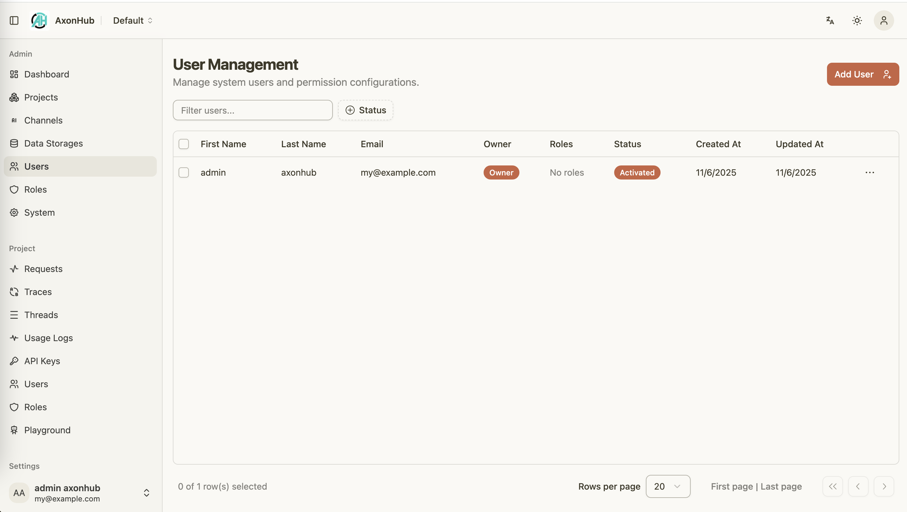
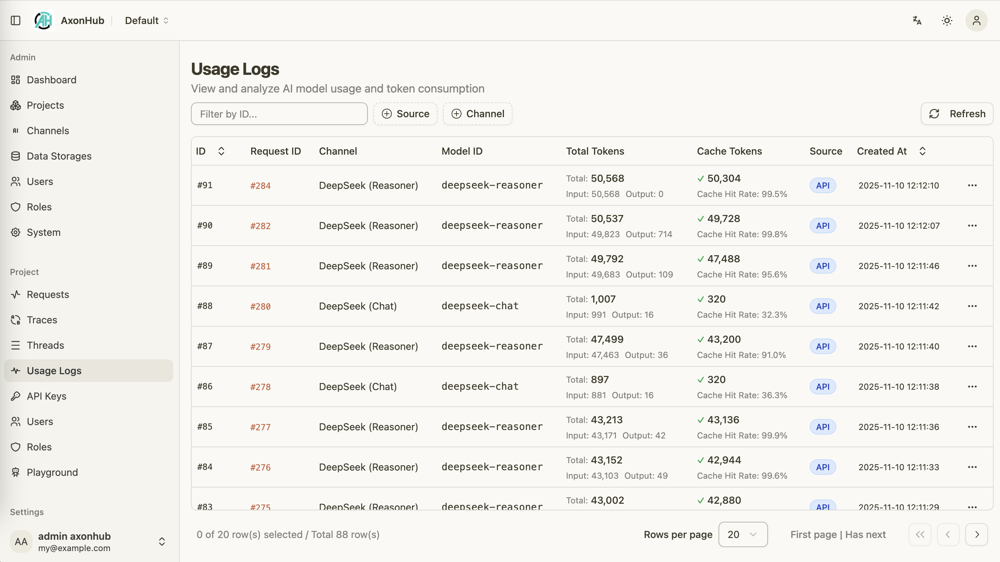
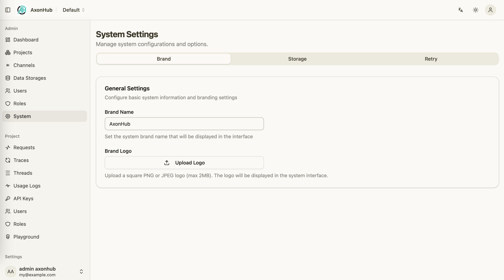

<div align="center">

# AxonHub - All-in-one AI Development Platform

</div>

<div align="center">

[](https://github.com/looplj/axonhub/actions/workflows/test.yml)
[](https://github.com/looplj/axonhub/actions/workflows/lint.yml)
[](https://golang.org/)
[](https://opensource.org/licenses/MIT)
[](https://docker.com)

[English](README.md) | [中文](README.zh-CN.md)

</div>

---

## 📖 Project Introduction

### All-in-one AI Development Platform

AxonHub is an all-in-one AI development platform that provides unified API gateway, project management, and comprehensive development tools. It offers OpenAI, Anthropic, and AI SDK compatible API layers, transforming requests to various AI providers through a transformer pipeline architecture. The platform features comprehensive tracing capabilities, project-based organization, and integrated playground for rapid prototyping, helping developers and enterprises better manage AI development workflows.

<div align="center">
  
</div>

### Core Problems Solved

| Problem                    | AxonHub Solution                                                          |
| -------------------------- | ------------------------------------------------------------------------- |
| **Vendor Lock-in**         | 🔄 Unified API interface, API format conversion, switch providers anytime |
| **Extensibility**          | Flexible transformer architecture, supports multiple transformers         |
| **Service Outages**        | ⚡ Automatic failover, multi-channel redundancy                           |
| **Permission Management**  | 📊 Comprehensive user permission management                               |
| **Development Complexity** | 🛠️ Single SDK, unified interface standard                                 |

---

## 📚 Documentation

For detailed technical documentation, API references, architecture design, and more, please visit

- [DeepWiki](https://deepwiki.com/looplj/axonhub).
- [Zread](https://zread.ai/looplj/axonhub).

---

## 🎯 Demo

Try AxonHub live at our [demo instance](https://axonhub.onrender.com)!

**Note**：The demo instance currently configures Zhipu and OpenRouter free models.

### Demo Account

- **Email**: demo@example.com
- **Password**: 12345678

---

## ⭐ Core Features

### 📸 Screenshots

Here are some screenshots of AxonHub in action:

<table>
  <tr>
    <td align="center">
      <a href="docs/screenshots/axonhub-dashboard.png">
        
      </a>
      <br/>
      System Dashboard
    </td>
    <td align="center">
      <a href="docs/screenshots/axonhub-channels.png">
        
      </a>
      <br/>
      Channel Management
    </td>
    <td align="center">
      <a href="docs/screenshots/axonhub-users.png">
        
      </a>
      <br/>
      User Management
    </td>
  </tr>
  <tr>
    <td align="center">
      <a href="docs/screenshots/axonhub-requests.png">
        
      </a>
      <br/>
      Request Monitoring
    </td>
    <td align="center">
      <a href="docs/screenshots/axonhub-usage-logs.png">
        
      </a>
      <br/>
      Usage Logs
    </td>
    <td align="center">
      <a href="docs/screenshots/axonhub-system.png">
        
      </a>
      <br/>
      System Setting
    </td>
  </tr>
</table>

---

### 🚀 Supported Features

| Feature              | Status     | Description                    | Document                                     |
| -------------------- | ---------- | ------------------------------ | -------------------------------------------- |
| **Chat Completion**  | ✅ Done    | Conversational interface       | [Chat Completions](docs/chat-completions.md) |
| **Image Generation** | ⚠️ Partial | Image generation               | [Image Generations](docs/image-generations.md) |
| **Rerank**           | 📝 Todo    | Results ranking                | -                                            |
| **Embedding**        | 📝 Todo    | Vector embedding generation    | -                                            |
| **Realtime**         | 📝 Todo    | Live conversation capabilities | -                                            |

---

### 🌐 Multi-Provider AI Gateway

| Feature                   | Technical Implementation                        | Business Value                              |
| ------------------------- | ----------------------------------------------- | ------------------------------------------- |
| **Unified API Interface** | OpenAI compatible standard, zero learning curve | Avoid vendor lock-in, reduce migration risk |
| **Automatic Failover**    | Multi-channel retry + load balancing            | Service interruption time < 100ms           |
| **Stream Processing**     | Native SSE support, real-time response          | 60% user experience improvement             |

---

### 🔧 API Format Support

| Format                      | Status     | Compatibility       | Modalities      |
| --------------------------- | ---------- | ------------------- | --------------- |
| **OpenAI Chat Completions** | ✅ Done    | Fully compatible    | Text, Image     |
| **Anthropic**               | ✅ Done    | Fully supported     | Text            |
| **AI SDK**                  | ⚠️ Partial | Partially supported | Text            |
| **Gemini**                  | 🔄 Todo    | -    | - |

---

### 🏢 Permission Control

| Security Feature                    | Implementation                     |
| ----------------------------------- | ---------------------------------- |
| **Fine-grained Permission Control** | Role-based access control (RBAC)   |
| **Data Localization**               | Configurable data storage policies |
| **API Key Management**              | JWT + scope control                |

---

## 🚀 Quick Start

### 1-click Deploy to Render

Deploy AxonHub with 1-click on [Render](https://render.com) for free.

<div>

<a href="https://render.com/deploy?repo=https://github.com/looplj/axonhub">
  
</a>

</div>

---

## 🚀 Deployment Guide

### 💻 Personal Computer Deployment

Perfect for individual developers and small teams. No complex configuration required.

#### Quick Download & Run

1. **Download the latest release** from [GitHub Releases](https://github.com/looplj/axonhub/releases)

   - Choose the appropriate version for your operating system:

2. **Extract and run**

   ```bash
   # Extract the downloaded file
   unzip axonhub_*.zip
   cd axonhub_*

   # Add execution permissions (only for Linux/macOS)
   chmod +x axonhub

   # Run directly - default SQLite database

   # Install AxonHub to system
   sudo ./install.sh

   # Start AxonHub service
   ./start.sh

   # Stop AxonHub service
   ./stop.sh
   ```

3. **Access the application**
   ```
   http://localhost:8090
   ```

---

### 🖥️ Server Deployment

For production environments, high availability, and enterprise deployments.

#### Database Support

AxonHub supports multiple databases to meet different scale deployment needs:

| Database       | Supported Versions | Recommended Scenario                             | Auto Migration | Links                                                       |
| -------------- | ------------------ | ------------------------------------------------ | -------------- | ----------------------------------------------------------- |
| **TiDB Cloud** | Starter            | Serverless, Free tier, Auto Scale                | ✅ Supported   | [TiDB Cloud](https://www.pingcap.com/tidb-cloud-starter/)   |
| **TiDB Cloud** | Dedicated          | Distributed deployment, large scale              | ✅ Supported   | [TiDB Cloud](https://www.pingcap.com/tidb-cloud-dedicated/) |
| **TiDB**       | V8.0+              | Distributed deployment, large scale              | ✅ Supported   | [TiDB](https://tidb.io/)                                    |
| **Neon DB**    | -                  | Serverless, Free tier, Auto Scale                | ✅ Supported   | [Neon DB](https://neon.com/)                                |
| **PostgreSQL** | 15+                | Production environment, medium-large deployments | ✅ Supported   | [PostgreSQL](https://www.postgresql.org/)                   |
| **MySQL**      | 8.0+               | Production environment, medium-large deployments | ✅ Supported   | [MySQL](https://www.mysql.com/)                             |
| **SQLite**     | 3.0+               | Development environment, small deployments       | ✅ Supported   | [SQLite](https://www.sqlite.org/index.html)                 |

#### Configuration

AxonHub uses YAML configuration files with environment variable override support:

```yaml
# config.yml
server:
  port: 8090
  name: "AxonHub"
  debug: false

db:
  dialect: "tidb"
  dsn: "<USER>.root:<PASSWORD>@tcp(gateway01.us-west-2.prod.aws.tidbcloud.com:4000)/axonhub?tls=true"

log:
  level: "info"
  encoding: "json"
```

Environment variables:

```bash
AXONHUB_SERVER_PORT=8090
AXONHUB_DB_DIALECT="tidb"
AXONHUB_DB_DSN="<USER>.root:<PASSWORD>@tcp(gateway01.us-west-2.prod.aws.tidbcloud.com:4000)/axonhub?tls=true"
AXONHUB_LOG_LEVEL=info
```

For detailed configuration instructions, please refer to [configuration documentation](config.example.yml).

#### Docker Compose Deployment

```bash
# Clone project
git clone https://github.com/looplj/axonhub.git
cd axonhub

# Set environment variables
export AXONHUB_DB_DIALECT="tidb"
export AXONHUB_DB_DSN="<USER>.root:<PASSWORD>@tcp(gateway01.us-west-2.prod.aws.tidbcloud.com:4000)/axonhub?tls=true"

# Start services
docker-compose up -d

# Check status
docker-compose ps
```

#### Virtual Machine Deployment

Download the latest release from [GitHub Releases](https://github.com/looplj/axonhub/releases)

```bash
# Extract and run
unzip axonhub_*.zip
cd axonhub_*

# Set environment variables
export AXONHUB_DB_DIALECT="tidb"
export AXONHUB_DB_DSN="<USER>.root:<PASSWORD>@tcp(gateway01.us-west-2.prod.aws.tidbcloud.com:4000)/axonhub?tls=true"

sudo ./install.sh

# Configuration file check
axonhub config check

# Start service
#  For simplicity, we recommend managing AxonHub with the helper scripts:

# Start
./start.sh

# Stop
./stop.sh
```

---

## 📖 Usage Guide

### 1. Initial Setup

1. **Access Management Interface**

   ```
   http://localhost:8090
   ```

2. **Configure AI Providers**

   - Add API keys in the management interface
   - Test connections to ensure correct configuration

3. **Create Users and Roles**
   - Set up permission management
   - Assign appropriate access permissions

### 2. Channel Configuration

Configure AI provider channels in the management interface:

```yaml
# OpenAI channel example
name: "openai"
type: "openai"
base_url: "https://api.openai.com/v1"
credentials:
  api_key: "your-openai-key"
supported_models: ["gpt-5", "gpt-4o"]
```

#### 2.1 Test Connection

Click the test button. If the test is successful, the configuration is correct.

#### 2.2 Enable Channel

After successful testing, click the enable button to activate the channel.

### 3. Add Users

1. Create user accounts
2. Assign roles and permissions
3. Create API keys

### 4. Claude Code/Codex Integration

#### 4.1 Using AxonHub in Claude Code:

```bash
# Set Claude Code to use AxonHub
export ANTHROPIC_API_KEY="your-axonhub-api-key"
export ANTHROPIC_BASE_URL="http://localhost:8090/anthropic"
```

#### 4.2 Using AxonHub in Codex:

configure the model provider in the codex config file: ${HOME}/.codex/config.toml

```toml
model = "gpt-5"
model_provider = "axonhub-chat-completions"

[model_providers.axonhub-chat-completions]
# Name of the provider that will be displayed in the Codex UI.
name = "AxonHub using Chat Completions"
# The path `/chat/completions` will be amended to this URL to make the POST
# request for the chat completions.
base_url = "http://127.0.0.1:8090/v1"
# If `env_key` is set, identifies an environment variable that must be set when
# using Codex with this provider. The value of the environment variable must be
# non-empty and will be used in the `Bearer TOKEN` HTTP header for the POST request.
env_key = "AXONHUB_API_KEY"
# Valid values for wire_api are "chat" and "responses". Defaults to "chat" if omitted.
wire_api = "chat"
# If necessary, extra query params that need to be added to the URL.
# See the Azure example below.
query_params = {}
```

#### 4.3. Model Profiles Feature

<table>
  <tr align="center">
    <td align="center">
      <a href="docs/screenshots/axonhub-profiles.png">
        
      </a>
      <br/>
      Model Profiles
    </td>
  </tr>
</table>

AxonHub introduces a powerful model profiles feature that allows you to configure multiple model mapping profiles for your API keys. This feature is particularly useful for scenarios where you need to:

- **Quick Model Switching**: Switch between different models without changing your API key configuration
- **Cost Optimization**: Map expensive model requests to more cost-effective alternatives automatically
- **Model Fallback**: Configure fallback mappings when certain models are unavailable

#### 4.4 How Profiles Work

When an active profile has model mappings configured, the system will automatically map requested models to their target models during API requests. For example:

- Request `claude-sonnet-20241022` → Actually use `deepseek-v3.1` (model mapping)
- Use regex patterns to match multiple models at once

#### 4.5 Claude Code/Codex + Profiles Workflow

With the profiles feature, you only need to configure Claude Code once:

1. **Configure your API key profiles** in the AxonHub management interface
2. **Set up model mappings** for different providers (zhipu, deepseek, moonshot, etc.)
3. **Switch active profiles** as needed without changing Claude Code configuration
4. **Claude Code automatically uses** the model mappings from your active profile

It eliminates the need to switch API keys or model names in development environments.

---

### 5. SDK Usage

#### Python SDK

```python
from openai import OpenAI

client = OpenAI(
    api_key="your-axonhub-api-key",
    base_url="http://localhost:8090/v1"
)

response = client.chat.completions.create(
    model="gpt-4o",
    messages=[{"role": "user", "content": "Hello!"}]
)
print(response.choices[0].message.content)
```

#### Node.js SDK

```javascript
import OpenAI from "openai";

const openai = new OpenAI({
  apiKey: "your-axonhub-api-key",
  baseURL: "http://localhost:8090/v1",
});

const completion = await openai.chat.completions.create({
  messages: [{ role: "user", content: "Hello!" }],
  model: "gpt-4o",
});
```

## 🛠️ Development Guide

For detailed development instructions, architecture design, and contribution guidelines, please see [DEVELOPMENT.md](DEVELOPMENT.md).

---

## 🤝 Acknowledgments

- 🙏 [musistudio/llms](https://github.com/musistudio/llms) - LLM transformation framework, source of inspiration
- 🎨 [satnaing/shadcn-admin](https://github.com/satnaing/shadcn-admin) - Admin interface template
- 🔧 [99designs/gqlgen](https://github.com/99designs/gqlgen) - GraphQL code generation
- 🌐 [gin-gonic/gin](https://github.com/gin-gonic/gin) - HTTP framework
- 🗄️ [ent/ent](https://github.com/ent/ent) - ORM framework
- ☁️ [Render](https://render.com) - Free cloud deployment platform for hosting our demo
- 🗃️ [TiDB Cloud](https://www.pingcap.com/tidb-cloud/) - Serverless database platform for demo deployment
- 🔧 [air](https://github.com/air-verse/air) - Auto reload Go service

---

## 📄 License

This project is open source under the MIT License. See [LICENSE](LICENSE) file for details.

---

<div align="center">

**AxonHub** - All-in-one AI Development Platform, making AI development simpler

[🏠 Homepage](https://github.com/looplj/axonhub) • [📚 Documentation](https://deepwiki.com/looplj/axonhub) • [🐛 Issue Feedback](https://github.com/looplj/axonhub/issues)

Built with ❤️ by the AxonHub team

</div>
