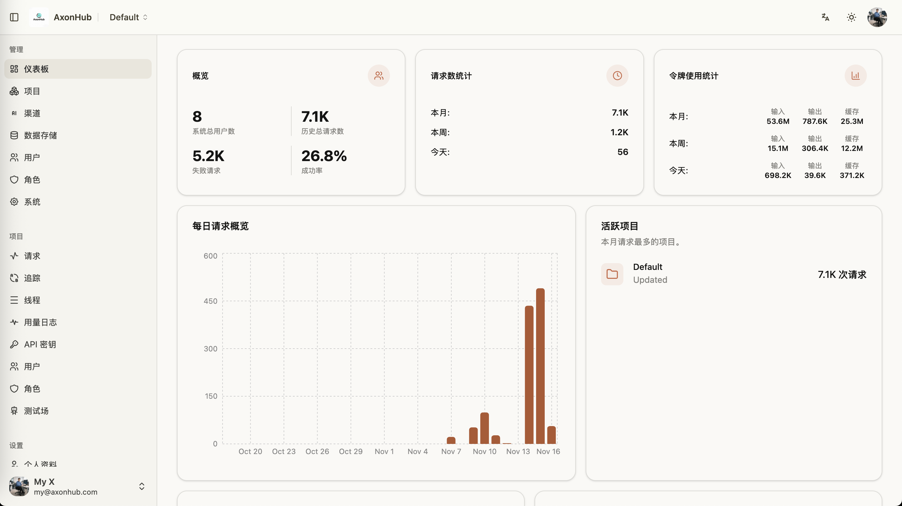
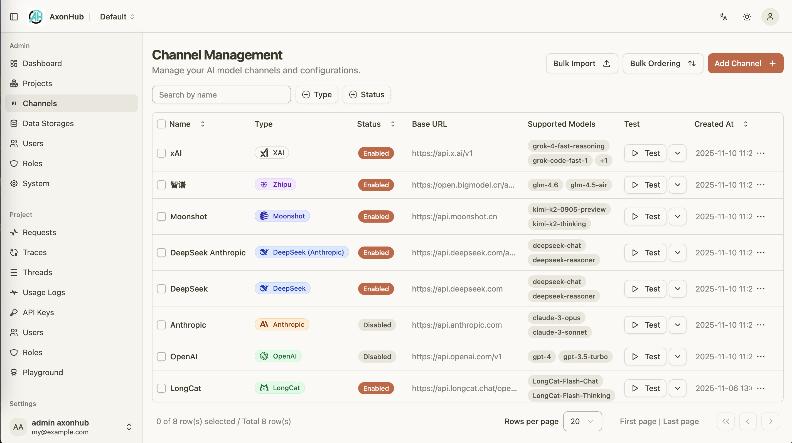
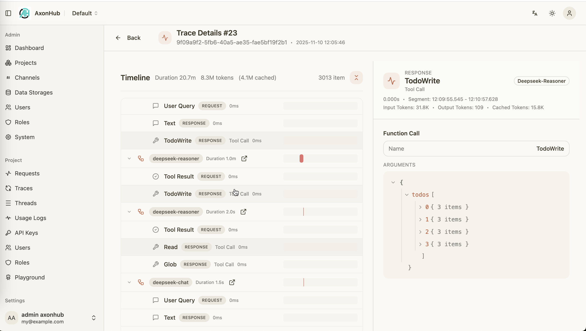
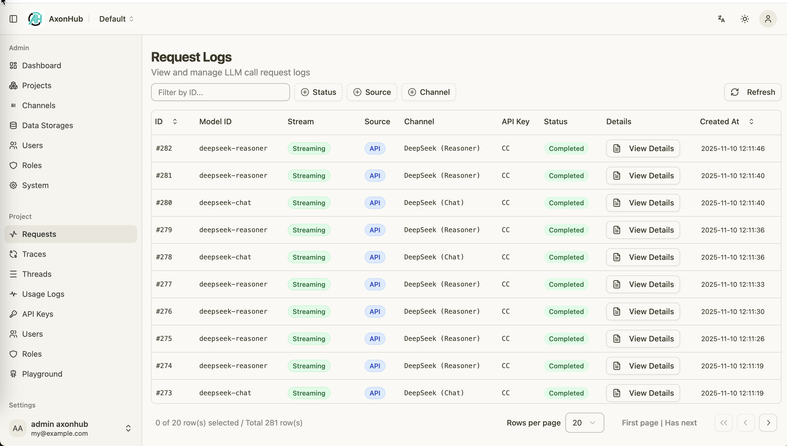

<div align="center">

# AxonHub - All-in-one AI 开发平台
### 任意 SDK、任意模型、零代码改动

<a href="https://trendshift.io/repositories/16225" target="_blank"></a>

</div>

<div align="center">

[](https://github.com/looplj/axonhub/actions/workflows/test.yml)
[](https://github.com/looplj/axonhub/actions/workflows/lint.yml)
[](https://golang.org/)
[](https://docker.com)

[English](README.md) | [中文](README.zh-CN.md)

</div>

---

## 📖 项目介绍

### All-in-one AI 开发平台

**AxonHub 是 AI 网关，让你无需改动一行代码即可切换模型供应商。**

无论你使用的是 OpenAI SDK、Anthropic SDK 还是任何 AI SDK，AxonHub 都会透明地将你的请求转换为与任何支持的模型供应商兼容的格式。无需重构，无需更换 SDK——只需更改配置即可。

**它解决了什么问题：**
- 🔒 **供应商锁定** - 从 GPT-4 瞬间切换到 Claude 或 Gemini
- 🔧 **集成复杂性** - 一个 API 格式对接 10+ 供应商
- 📊 **可观测性缺口** - 开箱即用的完整请求追踪
- 💸 **成本控制** - 实时用量追踪和预算管理

<div align="center">
  
</div>

### 核心特性 Core Features

| 特性 | 你能获得什么 |
|------|-------------|
| 🔄 [**任意 SDK → 任意模型**](docs/zh/api-reference/openai-api.md) | 用 OpenAI SDK 调用 Claude，或用 Anthropic SDK 调用 GPT。零代码改动。 |
| 🔍 [**完整请求追踪**](docs/zh/guides/tracing.md) | 线程级可观测性的完整请求时间线。更快定位问题。 |
| 🔐 [**企业级 RBAC**](docs/zh/guides/permissions.md) | 细粒度访问控制、用量配额和数据隔离。 |
| ⚡ [**智能负载均衡**](docs/zh/guides/load-balance.md) | <100ms 自动故障转移。始终路由到最健康的渠道。 |
| 💰 [**实时成本追踪**](docs/zh/guides/cost-tracking.md) | 每次请求的成本明细。输入、输出、缓存 Token——全部追踪。 |

---

## 📚 文档 | Documentation

### DeepWiki
详细的技术文档、API 参考、架构设计等内容，可以访问 
- [![DeepWiki](https://img.shields.io/badge/DeepWiki-looplj%2Faxonhub-blue.svg?logo=data:image/png;base64,iVBORw0KGgoAAAANSUhEUgAAACwAAAAyCAYAAAAnWDnqAAAAAXNSR0IArs4c6QAAA05JREFUaEPtmUtyEzEQhtWTQyQLHNak2AB7ZnyXZMEjXMGeK/AIi+QuHrMnbChYY7MIh8g01fJoopFb0uhhEqqcbWTp06/uv1saEDv4O3n3dV60RfP947Mm9/SQc0ICFQgzfc4CYZoTPAswgSJCCUJUnAAoRHOAUOcATwbmVLWdGoH//PB8mnKqScAhsD0kYP3j/Yt5LPQe2KvcXmGvRHcDnpxfL2zOYJ1mFwrryWTz0advv1Ut4CJgf5uhDuDj5eUcAUoahrdY/56ebRWeraTjMt/00Sh3UDtjgHtQNHwcRGOC98BJEAEymycmYcWwOprTgcB6VZ5JK5TAJ+fXGLBm3FDAmn6oPPjR4rKCAoJCal2eAiQp2x0vxTPB3ALO2CRkwmDy5WohzBDwSEFKRwPbknEggCPB/imwrycgxX2NzoMCHhPkDwqYMr9tRcP5qNrMZHkVnOjRMWwLCcr8ohBVb1OMjxLwGCvjTikrsBOiA6fNyCrm8V1rP93iVPpwaE+gO0SsWmPiXB+jikdf6SizrT5qKasx5j8ABbHpFTx+vFXp9EnYQmLx02h1QTTrl6eDqxLnGjporxl3NL3agEvXdT0WmEost648sQOYAeJS9Q7bfUVoMGnjo4AZdUMQku50McDcMWcBPvr0SzbTAFDfvJqwLzgxwATnCgnp4wDl6Aa+Ax283gghmj+vj7feE2KBBRMW3FzOpLOADl0Isb5587h/U4gGvkt5v60Z1VLG8BhYjbzRwyQZemwAd6cCR5/XFWLYZRIMpX39AR0tjaGGiGzLVyhse5C9RKC6ai42ppWPKiBagOvaYk8lO7DajerabOZP46Lby5wKjw1HCRx7p9sVMOWGzb/vA1hwiWc6jm3MvQDTogQkiqIhJV0nBQBTU+3okKCFDy9WwferkHjtxib7t3xIUQtHxnIwtx4mpg26/HfwVNVDb4oI9RHmx5WGelRVlrtiw43zboCLaxv46AZeB3IlTkwouebTr1y2NjSpHz68WNFjHvupy3q8TFn3Hos2IAk4Ju5dCo8B3wP7VPr/FGaKiG+T+v+TQqIrOqMTL1VdWV1DdmcbO8KXBz6esmYWYKPwDL5b5FA1a0hwapHiom0r/cKaoqr+27/XcrS5UwSMbQAAAABJRU5ErkJggg==)](https://deepwiki.com/looplj/axonhub)
- [![zread](https://img.shields.io/badge/Ask_Zread-_.svg?style=flat&color=00b0aa&labelColor=000000&logo=data%3Aimage%2Fsvg%2Bxml%3Bbase64%2CPHN2ZyB3aWR0aD0iMTYiIGhlaWdodD0iMTYiIHZpZXdCb3g9IjAgMCAxNiAxNiIgZmlsbD0ibm9uZSIgeG1sbnM9Imh0dHA6Ly93d3cudzMub3JnLzIwMDAvc3ZnIj4KPHBhdGggZD0iTTQuOTYxNTYgMS42MDAxSDIuMjQxNTZDMS44ODgxIDEuNjAwMSAxLjYwMTU2IDEuODg2NjQgMS42MDE1NiAyLjI0MDFWNC45NjAxQzEuNjAxNTYgNS4zMTM1NiAxLjg4ODEgNS42MDAxIDIuMjQxNTYgNS42MDAxSDQuOTYxNTZDNS4zMTUwMiA1LjYwMDEgNS42MDE1NiA1LjMxMzU2IDUuNjAxNTYgNC45NjAxVjIuMjQwMUM1LjYwMTU2IDEuODg2NjQgNS4zMTUwMiAxLjYwMDEgNC45NjE1NiAxLjYwMDFaIiBmaWxsPSIjZmZmIi8%2BCjxwYXRoIGQ9Ik00Ljk2MTU2IDEwLjM5OTlIMi4yNDE1NkMxLjg4ODEgMTAuMzk5OSAxLjYwMTU2IDEwLjY4NjQgMS42MDE1NiAxMS4wMzk5VjEzLjc1OTlDMS42MDE1NiAxNC4xMTM0IDEuODg4MSAxNC4zOTk5IDIuMjQxNTYgMTQuMzk5OUg0Ljk2MTU2QzUuMzE1MDIgMTQuMzk5OSA1LjYwMTU2IDE0LjExMzQgNS42MDE1NiAxMy43NTk5VjExLjAzOTlDNS42MDE1NiAxMC42ODY0IDUuMzE1MDIgMTAuMzk5OSA0Ljk2MTU2IDEwLjM5OTlaIiBmaWxsPSIjZmZmIi8%2BCjxwYXRoIGQ9Ik0xMy43NTg0IDEuNjAwMUgxMS4wMzg0QzEwLjY4NSAxLjYwMDEgMTAuMzk4NCAxLjg4NjY0IDEwLjM5ODQgMi4yNDAxVjQuOTYwMUMxMC4zOTg0IDUuMzEzNTYgMTAuNjg1IDUuNjAwMSAxMS4wMzg0IDUuNjAwMUgxMy43NTg0QzE0LjExMTkgNS42MDAxIDE0LjM5ODQgNS4zMTM1NiAxNC4zOTg0IDQuOTYwMVYyLjI0MDFDMTQuMzk4NCAxLjg4NjY0IDE0LjExMTkgMS42MDAxIDEzLjc1ODQgMS42MDAxWiIgZmlsbD0iI2ZmZiIvPgo8cGF0aCBkPSJNNCAxMkwxMiA0TDQgMTJaIiBmaWxsPSIjZmZmIi8%2BCjxwYXRoIGQ9Ik00IDEyTDEyIDQiIHN0cm9rZT0iI2ZmZiIgc3Ryb2tlLXdpZHRoPSIxLjUiIHN0cm9rZS1saW5lY2FwPSJyb3VuZCIvPgo8L3N2Zz4K&logoColor=ffffff)](https://zread.ai/looplj/axonhub)


---

## 🎯 演示 | Demo

在我们的 [演示实例](https://axonhub.onrender.com) 上体验 AxonHub！

**注意**：演示网站目前配置了 Zhipu 和 OpenRouter 的免费模型。

### 演示账号 | Demo Account
- **邮箱 Email**: demo@example.com
- **密码 Password**: 12345678

---

## ⭐ 特性 | Features

### 📸 截图 | Screenshots

以下是 AxonHub 的实际运行截图：

<table>
  <tr>
    <td align="center">
      <a href="docs/screenshots/axonhub-dashboard.png">
        
      </a>
      <br/>
      系统仪表板
    </td>
    <td align="center">
      <a href="docs/screenshots/axonhub-channels.png">
        
      </a>
      <br/>
      渠道管理
    </td>
    <td align="center">
      <a href="docs/screenshots/axonhub-model-price.png">
        
      </a>
      <br/>
      模型价格
    </td>
  </tr>
  <tr>
   <td align="center">
      <a href="docs/screenshots/axonhub-models.png">
        
      </a>
      <br/>
      模型
    </td>
    <td align="center">
      <a href="docs/screenshots/axonhub-trace.png">
        
      </a>
      <br/>
      追踪查看
    </td>
    <td align="center">
      <a href="docs/screenshots/axonhub-requests.png">
        
      </a>
      <br/>
      请求监控
    </td>
    
  </tr>
</table>

---

### 🚀 API 类型 | API Types

| API 类型 | 状态 | 描述 | 文档 |
|---------|--------|-------------|--------|
| **文本生成（Text Generation）** | ✅ Done | 对话交互接口 | [OpenAI API](docs/zh/api-reference/openai-api.md)、[Anthropic API](docs/zh/api-reference/anthropic-api.md)、[Gemini API](docs/zh/api-reference/gemini-api.md) |
| **图片生成（Image Generation）** | ✅ Done | 图片生成 | [Image Generation](docs/zh/api-reference/image-generation.md) |
| **重排序（Rerank）** | ✅ Done | 结果排序 | [Rerank API](docs/zh/api-reference/rerank-api.md) |
| **嵌入（Embedding）** | ✅ Done | 向量嵌入生成 | [Embedding API](docs/zh/api-reference/embedding-api.md) |
| **实时对话（Realtime）** | 📝 Todo | 实时对话功能 | - |

---

### 🤖 支持的提供商 | Supported Providers

| 提供商 Provider        | 状态 Status | 支持模型 Models              | 兼容 API |
| ---------------------- | ---------- | ---------------------------- | --------------- |
| **OpenAI**             | ✅ 已完成   | GPT-4, GPT-4o, GPT-5 等      | OpenAI, Anthropic, Gemini, Embedding, Image Generation |
| **Anthropic**          | ✅ 已完成   | Claude 3.5, Claude 3.0 等    | OpenAI, Anthropic, Gemini |
| **智谱 AI (Zhipu)**    | ✅ 已完成   | GLM-4.5, GLM-4.5-air 等      | OpenAI, Anthropic, Gemini |
| **月之暗面 (Moonshot)** | ✅ 已完成   | kimi-k2 等                   | OpenAI, Anthropic, Gemini |
| **DeepSeek**           | ✅ 已完成   | DeepSeek-V3.1 等             | OpenAI, Anthropic, Gemini |
| **字节跳动豆包**        | ✅ 已完成   | doubao-1.6 等                | OpenAI, Anthropic, Gemini, Image Generation |
| **Gemini**             | ✅ 已完成   | Gemini 2.5 等                | OpenAI, Anthropic, Gemini, Image Generation |
| **Jina AI**            | ✅ 已完成   | Embeddings, Reranker 等      | Jina Embedding, Jina Rerank |
| **OpenRouter**         | ✅ 已完成   | 多种模型                     | OpenAI, Anthropic, Gemini, Image Generation |
| **ZAI**                | ✅ 已完成   | -                            | Image Generation |
| **AWS Bedrock**        | 🔄 测试中  | Claude on AWS                | OpenAI, Anthropic, Gemini |
| **Google Cloud**       | 🔄 测试中  | Claude on GCP                | OpenAI, Anthropic, Gemini |

---


## 🚀 快速开始 | Quick Start

### 30 秒本地启动 | 30-Second Local Start

```bash
# 下载并解压（以 macOS ARM64 为例）
curl -sSL https://github.com/looplj/axonhub/releases/latest/download/axonhub_darwin_arm64.tar.gz | tar xz
cd axonhub_*

# 使用 SQLite 运行（默认）
./axonhub

# 打开 http://localhost:8090
# 默认登录：admin@axonhub.com / admin
```

就这样！现在配置你的第一个 AI 渠道，开始通过 AxonHub 调用模型。

### 零代码迁移示例 | Zero-Code Migration Example

**你的现有代码无需任何改动。** 只需将 SDK 指向 AxonHub：

```python
from openai import OpenAI

client = OpenAI(
    base_url="http://localhost:8090/v1",  # 指向 AxonHub
    api_key="your-axonhub-api-key"        # 使用 AxonHub API 密钥
)

# 用 OpenAI SDK 调用 Claude！
response = client.chat.completions.create(
    model="claude-3-5-sonnet",  # 或 gpt-4、gemini-pro、deepseek-chat...
    messages=[{"role": "user", "content": "Hello!"}]
)
```

切换模型只需改一行：`model="gpt-4"` → `model="claude-3-5-sonnet"`。无需改动 SDK。

---

## 🚀 部署指南 | Deployment Guide

### 💻 个人电脑部署 | Personal Computer Deployment

适合个人开发者和小团队使用，无需复杂配置。

#### 快速下载运行 | Quick Download & Run

1. **下载最新版本** 从 [GitHub Releases](https://github.com/looplj/axonhub/releases)
   - 选择适合您操作系统的版本：

2. **解压并运行**
   ```bash
   # 解压下载的文件
   unzip axonhub_*.zip
   cd axonhub_*
   
   # 添加执行权限 (仅限 Linux/macOS)
   chmod +x axonhub
   
   # 直接运行 - 默认使用 SQLite 数据库
   # 安装 AxonHub 到系统
   ./install.sh

   # 启动 AxonHub 服务
   ./start.sh

   # 停止 AxonHub 服务
   ./stop.sh
   ```

3. **访问应用**
   ```
   http://localhost:8090
   ```

---

### 🖥️ 服务器部署 | Server Deployment

适用于生产环境、高可用性和企业级部署。

#### 数据库支持 | Database Support

AxonHub 支持多种数据库，满足不同规模的部署需求：

| 数据库 | 支持版本 | 推荐场景 | 自动迁移 | 链接 |
|--------|----------|----------|----------|------|
| **SQLite** | 3.0+ | 开发环境、小型部署 | ✅ 支持 | [SQLite](https://www.sqlite.org/index.html) |
| **TiDB Cloud** | Starter | Serverless, Free tier, Auto Scale | ✅ 支持 | [TiDB Cloud](https://www.pingcap.com/tidb-cloud-starter/) |
| **TiDB Cloud** | Dedicated | 分布式部署、大规模 | ✅ 支持 | [TiDB Cloud](https://www.pingcap.com/tidb-cloud-dedicated/) |
| **TiDB** | V8.0+ | 分布式部署、大规模 | ✅ 支持 | [TiDB](https://tidb.io/) |
| **Neon DB** | - | Serverless, Free tier, Auto Scale | ✅ 支持 | [Neon DB](https://neon.com/) |
| **PostgreSQL** | 15+ | 生产环境、中大型部署 | ✅ 支持 | [PostgreSQL](https://www.postgresql.org/) |
| **MySQL** | 8.0+ | 生产环境、中大型部署 | ✅ 支持 | [MySQL](https://www.mysql.com/) |

#### 配置文件 | Configuration

AxonHub 使用 YAML 配置文件，支持环境变量覆盖：

```yaml
# config.yml
server:
  port: 8090
  name: "AxonHub"
  debug: false

db:
  dialect: "tidb"
  dsn: "<USER>.root:<PASSWORD>@tcp(gateway01.us-west-2.prod.aws.tidbcloud.com:4000)/axonhub?tls=true&parseTime=true&multiStatements=true&charset=utf8mb4"

log:
  level: "info"
  encoding: "json"
```

环境变量：
```bash
AXONHUB_SERVER_PORT=8090
AXONHUB_DB_DIALECT="tidb"
AXONHUB_DB_DSN="<USER>.root:<PASSWORD>@tcp(gateway01.us-west-2.prod.aws.tidbcloud.com:4000)/axonhub?tls=true&parseTime=true&multiStatements=true&charset=utf8mb4"
AXONHUB_LOG_LEVEL=info
```

详细配置说明请参考 [配置文档](config.example.yml)。

#### Docker Compose 部署

```bash
# 克隆项目
git clone https://github.com/looplj/axonhub.git
cd axonhub

# 设置环境变量
export AXONHUB_DB_DIALECT="tidb"
export AXONHUB_DB_DSN="<USER>.root:<PASSWORD>@tcp(gateway01.us-west-2.prod.aws.tidbcloud.com:4000)/axonhub?tls=true&parseTime=true&multiStatements=true&charset=utf8mb4"

# 启动服务
docker-compose up -d

# 查看状态
docker-compose ps
```

#### 虚拟机部署 | Virtual Machine Deployment

下载最新版本从 [GitHub Releases](https://github.com/looplj/axonhub/releases)

```bash
# 克隆项目
git clone https://github.com/looplj/axonhub.git
cd axonhub

# 设置环境变量
export AXONHUB_DB_DIALECT="tidb"
export AXONHUB_DB_DSN="<USER>.root:<PASSWORD>@tcp(gateway01.us-west-2.prod.aws.tidbcloud.com:4000)/axonhub?tls=true&parseTime=true&multiStatements=true&charset=utf8mb4"

# 安装
sudo ./install.sh

# 配置文件检查
axonhub config check

# 使用管理脚本管理 AxonHub

# 启动
./start.sh

# 停止
./stop.sh
```

---

## 📖 使用指南 | Usage Guide

### 1. 初始化设置 | Initial Setup

1. **访问管理界面**
   ```
   http://localhost:8090
   ```

2. **配置 AI 提供商**
   - 在管理界面中添加 API 密钥
   - 测试连接确保配置正确

3. **创建用户和角色**
   - 设置权限管理
   - 分配适当的访问权限

### 2. Channel 配置 | Channel Configuration

在管理界面中配置 AI 提供商渠道。关于渠道配置的详细信息，包括模型映射、参数覆盖和故障排除，请参阅 [渠道配置指南](docs/zh/guides/channel-management.md)。

### 3. 模型管理 | Model Management

AxonHub 提供灵活的模型管理系统，支持通过模型关联将抽象模型映射到特定渠道和模型实现。这使您能够：

- **统一模型接口** - 使用抽象模型 ID（如 `gpt-4`、`claude-3-opus`）替代渠道特定的名称
- **智能渠道选择** - 基于关联规则和负载均衡自动将请求路由到最优渠道
- **灵活的映射策略** - 支持精确的渠道-模型匹配、正则表达式模式和基于标签的选择
- **基于优先级的回退** - 配置多个具有优先级的关联以实现自动故障转移

关于模型管理的全面信息，包括关联类型、配置示例和最佳实践，请参阅 [模型管理指南](docs/zh/guides/model-management.md)。

### 4. 创建 API Key | Create API Keys

创建 API 密钥以验证您的应用程序与 AxonHub 的连接。每个 API 密钥可以配置多个配置文件（Profile），用于定义：

- **模型映射** - 使用精确匹配或正则表达式模式将用户请求的模型转换为实际可用的模型
- **渠道限制** - 通过渠道 ID 或标签限制 API 密钥可以使用的渠道
- **模型访问控制** - 控制特定配置文件可以访问的模型
- **配置文件切换** - 通过激活不同的配置文件即时更改行为

关于 API 密钥配置文件的详细信息，包括配置示例、验证规则和最佳实践，请参阅 [API 密钥配置文件指南](docs/zh/guides/api-key-profiles.md)。

### 5. AI 编程工具集成 | AI Coding Tools Integration

关于如何在 OpenCode、Claude Code 与 Claude Codex 中配置与 AxonHub 的集成、排查常见问题以及结合模型配置文件工作流的最佳实践，请参阅专门的集成指南：
- [OpenCode 集成指南](docs/zh/guides/opencode-integration.md)
- [Claude Code 集成指南](docs/zh/guides/claude-code-integration.md)
- [Codex 集成指南](docs/zh/guides/codex-integration.md)

这些文档提供了环境变量示例、Codex 配置模板、模型配置文件说明以及工作流示例，帮助您快速完成接入。

---

### 6. 使用 SDK | SDK Usage

详细的 SDK 使用示例和代码示例，请参阅 API 文档：
- [OpenAI API](docs/zh/api-reference/openai-api.md)
- [Anthropic API](docs/zh/api-reference/anthropic-api.md)
- [Gemini API](docs/zh/api-reference/gemini-api.md)


## 🛠️ 开发指南

详细的开发说明、架构设计和贡献指南，请查看 [docs/zh/guides/development.md](docs/zh/guides/development.md)。

---

## 🤝 致谢 | Acknowledgments

- 🙏 [musistudio/llms](https://github.com/musistudio/llms) - LLM 转换框架，灵感来源
- 🎨 [satnaing/shadcn-admin](https://github.com/satnaing/shadcn-admin) - 管理界面模板
- 🔧 [99designs/gqlgen](https://github.com/99designs/gqlgen) - GraphQL 代码生成
- 🌐 [gin-gonic/gin](https://github.com/gin-gonic/gin) - HTTP 框架
- 🗄️ [ent/ent](https://github.com/ent/ent) - ORM 框架
- 🔧 [air-verse/air](https://github.com/air-verse/air) - 自动重载 Go 服务
- ☁️ [render](https://render.com) - 免费云部署平台，用于部署 demo
- 🗄️ [tidbcloud](https://www.pingcap.com/tidb-cloud/) - Serverless 数据库平台，用于部署 demo

---

## 📄 许可证 | License

本项目采用多种许可证授权（Apache-2.0 和 LGPL-3.0）。详见 [LICENSE](LICENSE) 文件了解详细的项目授权说明与条款。
---

<div align="center">

**AxonHub** - All-in-one AI 开发平台，让 AI 开发更简单

[🏠 官网](https://github.com/looplj/axonhub) • [📚 文档](https://deepwiki.com/looplj/axonhub) • [🐛 问题反馈](https://github.com/looplj/axonhub/issues)

Built with ❤️ by the AxonHub team

</div>