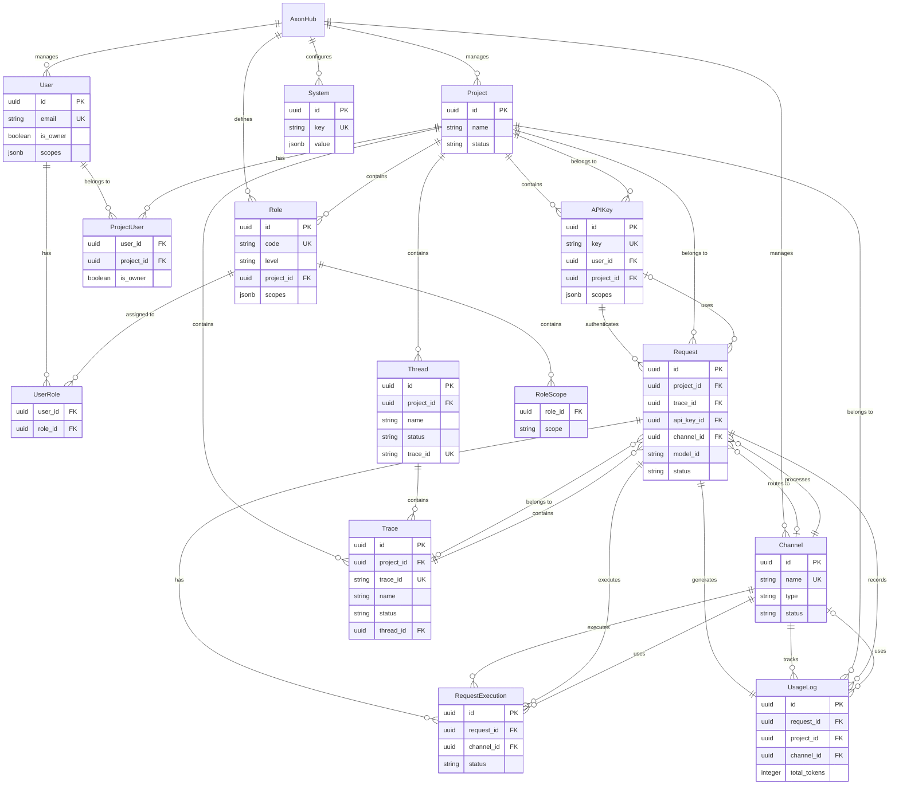

# AxonHub Entity Relationship Diagram (ERD)

## Overview

AxonHub adopts a multi-level permission management architecture, supporting both Global and Project levels. The system manages user permissions through an RBAC (Role-Based Access Control) model, enabling fine-grained resource access control.

---

## Core Concepts

### Hierarchical Structure

- **Global Level**: System-level configurations and resources shared by all Projects
- **Project Level**: Project-level resources belonging to specific Projects but also globally visible

### Permission Model

- **Owner**: Has all permissions and can manage all resources
- **Custom Roles + Scopes**: Fine-grained permission control through combination of roles and permission scopes

---

## Entity Detailed Description

### 1. User

**Description**: System user entity representing individuals or service accounts using AxonHub.

**Level**: Global

**Fields**:
- `id`: User unique identifier
- `email`: User email (unique)
- `status`: User status (activated/deactivated)
- `prefer_language`: User preferred language
- `password`: Password (sensitive field)
- `first_name`: First name
- `last_name`: Last name
- `avatar`: User avatar URL
- `is_owner`: Whether system owner
- `scopes`: User-specific permission scopes (e.g., write_channels, read_channels, add_users, read_users, etc.)
- `created_at`: Creation time
- `updated_at`: Update time
- `deleted_at`: Soft deletion time

**Permissions**:
- Global Owner: Has all permissions
- Custom Roles + Scopes: Has specified permissions based on assigned roles and scopes

**Relationships**:
- Can belong to multiple Projects (through Project-User association)
- Can have multiple Roles
- Can create multiple API Keys
- Can initiate multiple Requests
- Can generate multiple Usage Logs

---

### 2. Project

**Description**: Project entity for organizing and isolating resources of different businesses or teams.

**Level**: Global (Projects themselves are managed globally)

**Fields**:
- `id`: Project unique identifier
- `name`: Project name
- `description`: Project description
- `status`: Project status
- `created_at`: Creation time
- `updated_at`: Update time
- `deleted_at`: Soft deletion time

**Permissions**:
- Project Owner: Has all permissions within the project
- Custom Roles + Scopes: Has specified permissions based on roles and scopes assigned within the project

**Relationships**:
- Contains multiple Users (project members)
- Contains multiple Project-level Roles
- Contains multiple API Keys
- Contains multiple Requests
- Contains multiple Usage Logs
- Contains multiple Threads
- Contains multiple Traces

---

### 3. Channel

**Description**: AI service provider access channel configuration, such as OpenAI, Anthropic, Gemini, etc.

**Level**: Global (shared by all Projects)

**Fields**:
- `id`: Channel unique identifier
- `type`: Channel type (openai, anthropic, gemini_openai, deepseek, etc.)
- `base_url`: API base URL
- `name`: Channel name (unique)
- `status`: Channel status (enabled/disabled/archived)
- `credentials`: Channel credentials (sensitive field)
- `supported_models`: List of supported models
- `default_test_model`: Default test model
- `settings`: Channel settings (includes model mappings, etc.)
- `ordering_weight`: Display ordering weight
- `created_at`: Creation time
- `updated_at`: Update time
- `deleted_at`: Soft deletion time

**Permissions**:
- Requires `read_channels` permission to read
- Requires `write_channels` permission to modify

**Relationships**:
- Can be used by multiple Requests
- Can be used by multiple Request Executions
- Associated with multiple Usage Logs

---

### 4. System

**Description**: System-level configuration items, such as Logo, system name, and other global settings.

**Level**: Global (shared by all Projects)

**Fields**:
- `id`: Configuration unique identifier
- `key`: Configuration key (unique)
- `value`: Configuration value
- `created_at`: Creation time
- `updated_at`: Update time
- `deleted_at`: Soft deletion time

**Permissions**:
- Requires `read_settings` permission to read
- Requires `write_settings` permission to modify

**Relationships**: No direct associations

---

### 5. Role

**Description**: User role definition containing a set of permission scopes (Scopes).

**Level**: Can be Global or Project

**Fields**:
- `id`: Role unique identifier
- `code`: Role code (unique, immutable)
- `name`: Role name
- `scopes`: Permission scopes included in the role (e.g., write_channels, read_channels, add_users, read_users, etc.)
- `level`: Role level (global/project)
- `project_id`: Project ID (required for Project-level roles)
- `created_at`: Creation time
- `updated_at`: Update time
- `deleted_at`: Soft deletion time

**Permission Rules**:
- Global Roles can only configure Global Scopes
- Project Roles can configure both Global and Project Scopes

**Relationships**:
- Can be assigned to multiple Users

---

### 6. Scope

**Description**: Fine-grained permission definition, such as `read_channels`, `write_requests`, etc.

**Level**: Can be Global, Project, or both

**Example Scopes**:
- `read_channels`: Read channels
- `write_channels`: Write channels
- `read_users`: Read users
- `write_users`: Write users
- `read_api_keys`: Read API Keys
- `write_api_keys`: Write API Keys
- `read_requests`: Read requests
- `write_requests`: Write requests
- `read_settings`: Read system settings
- `write_settings`: Write system settings
- `read_roles`: Read roles
- `write_roles`: Write roles

---

### 7. API Key

**Description**: API authentication key, each API Key belongs to a specific user and project.

**Level**: Project

**Fields**:
- `id`: API Key unique identifier
- `user_id`: Owning user ID
- `project_id`: Owning project ID
- `key`: API key (unique, immutable)
- `name`: API Key name
- `status`: Status (enabled/disabled/archived)
- `scopes`: API Key-specific permission scopes (default: read_channels, write_requests)
- `profiles`: API Key profiles
- `created_at`: Creation time
- `updated_at`: Update time
- `deleted_at`: Soft deletion time

**Permissions**:
- Users can only manage their own API Keys
- Owner can manage all API Keys

**Relationships**:
- Belongs to one User
- Belongs to one Project
- Can initiate multiple Requests

---

### 8. Thread

**Description**: Thread entity for organizing and tracking collections of related Traces, enabling request chain observability.

**Level**: Project

**Fields**:
- `id`: Thread unique identifier
- `project_id`: Owning project ID
- `name`: Thread name
- `description`: Thread description
- `status`: Thread status (active/archived)
- `trace_id`: Thread trace ID (unique)
- `created_at`: Creation time
- `updated_at`: Update time
- `deleted_at`: Soft deletion time

**Permissions**:
- Users can only view and manage Threads within their projects
- Owner can view and manage all Threads

**Relationships**:
- Belongs to one Project
- Contains multiple Traces
- Contains one Trace ID for tracking

---

### 9. Trace

**Description**: Trace entity for recording and tracking a set of related Requests, enabling distributed link tracing.

**Level**: Project

**Fields**:
- `id`: Trace unique identifier
- `project_id`: Owning project ID
- `trace_id`: Trace ID (unique)
- `name`: Trace name
- `description`: Trace description
- `status`: Trace status (active/completed/failed)
- `thread_id`: Owning thread ID (optional)
- `created_at`: Creation time
- `updated_at`: Update time
- `deleted_at`: Soft deletion time

**Permissions**:
- Users can only view and manage Traces within their projects
- Owner can view and manage all Traces

**Relationships**:
- Belongs to one Project
- Optionally belongs to one Thread
- Contains multiple Requests

---

### 10. Request

**Description**: AI model requests initiated by users via API or Playground.

**Level**: Project

**Fields**:
- `id`: Request unique identifier
- `api_key_id`: API Key ID (optional, empty for requests from Admin)
- `project_id`: Owning project ID
- `trace_id`: Owning trace ID (optional)
- `source`: Request source (api/playground/test)
- `model_id`: Model identifier
- `format`: Request format (e.g., openai/chat_completions, claude/messages)
- `request_body`: Raw request body (user format)
- `response_body`: Final response body (user format)
- `response_chunks`: Streaming response chunks
- `channel_id`: Used channel ID
- `external_id`: External system tracking ID
- `status`: Request status (pending/processing/completed/failed/canceled)
- `stream`: Whether it's a streaming request
- `created_at`: Creation time
- `updated_at`: Update time
- `deleted_at`: Soft deletion time

**Permissions**:
- Users can only view and manage their own Requests
- Owner can view and manage all Requests

**Relationships**:
- Belongs to one User
- Belongs to one Project
- Optionally associated with one API Key
- Optionally associated with one Trace
- Optionally associated with one Channel
- Contains multiple Request Executions
- Associated with one Usage Log

---

### 11. Request Execution

**Description**: Actual execution record of a Request on a specific Channel. A Request may have multiple executions (e.g., retries, fallback).

**Level**: Project (follows Request)

**Fields**:
- `id`: Execution unique identifier
- `request_id`: Associated request ID
- `channel_id`: Execution channel ID
- `external_id`: External system tracking ID
- `model_id`: Model identifier
- `format`: Request format
- `request_body`: Request body sent to provider (provider format)
- `response_body`: Response body returned by provider (provider format)
- `response_chunks`: Streaming response chunks (provider format)
- `error_message`: Error message
- `status`: Execution status (pending/processing/completed/failed/canceled)
- `created_at`: Creation time
- `updated_at`: Update time

**Relationships**:
- Belongs to one Request
- Uses one Channel

---

### 12. Usage Log

**Description**: Records token usage and cost information for each Request for statistics and billing.

**Level**: Project

**Fields**:
- `id`: Log unique identifier
- `request_id`: Associated request ID
- `project_id`: Owning project ID
- `channel_id`: Used channel ID
- `model_id`: Model identifier
- `prompt_tokens`: Prompt token count
- `completion_tokens`: Completion token count
- `total_tokens`: Total token count
- `prompt_audio_tokens`: Prompt audio token count
- `prompt_cached_tokens`: Prompt cached token count
- `completion_audio_tokens`: Completion audio token count
- `completion_reasoning_tokens`: Completion reasoning token count
- `completion_accepted_prediction_tokens`: Accepted prediction token count
- `completion_rejected_prediction_tokens`: Rejected prediction token count
- `source`: Request source (api/playground/test)
- `format`: Request format
- `created_at`: Creation time
- `updated_at`: Update time
- `deleted_at`: Soft deletion time

**Permissions**:
- Users can only view their own Usage Logs
- Owner can view all Usage Logs

**Relationships**:
- Belongs to one User
- Belongs to one Project
- Associated with one Request
- Optionally associated with one Channel

---

## Entity Relationship Diagram

### Mermaid ERD



### Global Level Relationships

```
Global
├── Users (Multiple)
│   ├── is_owner: true (Owner users)
│   └── scopes + roles (Custom permissions)
├── Channels (Multiple, shared by all Projects)
├── System Configs (Multiple, shared by all Projects)
└── Global Roles (Multiple)
```

### Project Level Relationships

```
Project
├── Users (Multiple project members)
│   ├── owner: true (Project Owner)
│   └── project_roles + scopes (Permissions within project)
├── Project Roles (Multiple)
├── API Keys (Multiple)
├── Threads (Multiple)
├── Traces (Multiple)
├── Requests (Multiple)
│   ├── Request Executions (Multiple)
│   └── Usage Log (One)
└── Usage Logs (Multiple)
```

### Detailed Relationships

#### User Relationships
- **User** → **Projects** (Many-to-Many): Users can join multiple projects
- **User** → **Roles** (Many-to-Many): Users can have multiple roles (Global and Project)
- **User** → **API Keys** (One-to-Many): Users can create multiple API Keys
- **User** → **Requests** (One-to-Many): Users can initiate multiple requests
- **User** → **Usage Logs** (One-to-Many): Users generate multiple usage logs

#### Project Relationships
- **Project** → **Users** (Many-to-Many): Projects contain multiple users
- **Project** → **Roles** (One-to-Many): Projects contain multiple project-level roles
- **Project** → **API Keys** (One-to-Many): Projects contain multiple API Keys
- **Project** → **Requests** (One-to-Many): Projects contain multiple requests
- **Project** → **Usage Logs** (One-to-Many): Projects contain multiple usage logs
- **Project** → **Threads** (One-to-Many): Projects contain multiple threads
- **Project** → **Traces** (One-to-Many): Projects contain multiple traces

#### Channel Relationships
- **Channel** → **Requests** (One-to-Many): Channels can process multiple requests
- **Channel** → **Request Executions** (One-to-Many): Channels can execute multiple requests
- **Channel** → **Usage Logs** (One-to-Many): Channels associated with multiple usage logs

#### Request Relationships
- **Request** → **User** (Many-to-One): Request belongs to one user
- **Request** → **Project** (Many-to-One): Request belongs to one project
- **Request** → **API Key** (Many-to-One, Optional): Request may use one API Key
- **Request** → **Trace** (Many-to-One, Optional): Request may belong to one Trace
- **Request** → **Channel** (Many-to-One, Optional): Request may use one Channel
- **Request** → **Request Executions** (One-to-Many): Request contains multiple execution records
- **Request** → **Usage Log** (One-to-One): Request associated with one usage log

#### Role Relationships
- **Role** → **Users** (Many-to-Many): Roles can be assigned to multiple users
- **Role** → **Scopes** (One-to-Many): Roles contain multiple permission scopes

#### Thread Relationships
- **Thread** → **Project** (Many-to-One): Thread belongs to one project
- **Thread** → **Traces** (One-to-Many): Thread contains multiple traces

#### Trace Relationships
- **Trace** → **Project** (Many-to-One): Trace belongs to one project
- **Trace** → **Thread** (Many-to-One, Optional): Trace may belong to one thread
- **Trace** → **Requests** (One-to-Many): Trace contains multiple requests

---

## RBAC Permission Model

### Scope Levels

| Scope | Level | Description |
|-------|-------|-------------|
| `read_channels` | Global | Read channel information |
| `write_channels` | Global | Create/modify channels |
| `read_users` | Global | Read user information |
| `write_users` | Global | Create/modify users |
| `read_settings` | Global | Read system settings |
| `write_settings` | Global | Modify system settings |
| `read_roles` | Global/Project | Read role information |
| `write_roles` | Global/Project | Create/modify roles |
| `read_api_keys` | Project | Read API Keys |
| `write_api_keys` | Project | Create/modify API Keys |
| `read_requests` | Project | Read request records |
| `write_requests` | Project | Create requests |

### Role Level Rules

1. **Global Role**:
   - Can only configure Global Scopes
   - Effective in all Projects
   - Examples: System Admin, Channel Manager

2. **Project Role**:
   - Can configure both Global and Project Scopes
   - Only effective in specific Project
   - Examples: Project Admin, Developer, Viewer

### Permission Inheritance Rules

1. **Global Owner**:
   - Has all Global and Project permissions
   - Can manage all resources

2. **Project Owner**:
   - Has all permissions within the project
   - Can manage all resources within the project

3. **Custom Roles**:
   - Get permissions according to Scopes defined in the Role
   - Global Role permissions are effective in all Projects
   - Project Role permissions are only effective in specific Project

---

## Data Flow Examples

### API Request Flow

```
1. User initiates request using API Key
   ↓
2. System validates API Key permissions (scopes)
   ↓
3. Create Request record (associated with User, Project, API Key)
   ↓
4. Select appropriate Channel
   ↓
5. Create Request Execution record
   ↓
6. Call Channel to execute request
   ↓
7. Record response to Request Execution
   ↓
8. Update Request status and response
   ↓
9. Create Usage Log record to track token usage
```

### Permission Check Flow

```
1. User initiates operation request
   ↓
2. Check if user is Owner
   ├─ Yes → Allow operation
   └─ No → Continue checking
       ↓
3. Check user's Global Roles and Scopes
   ├─ Has permission → Allow operation
   └─ No permission → Continue checking
       ↓
4. Check user's Roles and Scopes in current Project
   ├─ Has permission → Allow operation
   └─ No permission → Deny operation
```

---

## Indexing Strategy

### Performance Optimization Indexes

1. **User**:
   - `email` (unique index)

2. **Channel**:
   - `name` (unique index)

3. **Role**:
   - `code` (unique index)

4. **API Key**:
   - `key` (unique index)
   - `user_id` (regular index)

5. **Request**:
   - `api_key_id` (regular index)
   - `channel_id` (regular index)
   - `trace_id` (regular index)
   - `created_at` (regular index, for time range queries)
   - `status` (regular index, for status filtering)

6. **Thread**:
   - `project_id` (regular index)
   - `trace_id` (unique index)

7. **Trace**:
   - `project_id` (regular index)
   - `trace_id` (unique index)
   - `thread_id` (regular index)

8. **Request Execution**:
   - `request_id` (regular index)
   - `channel_id` (regular index)

9. **Usage Log**:
   - `request_id` (regular index)
   - `channel_id` (regular index)
   - `created_at` (regular index)
   - `model_id` (regular index)
   - `(user_id, created_at)` (composite index, for user cost analysis)
   - `(channel_id, created_at)` (composite index, for channel usage analysis)

---

## Soft Delete Mechanism

The following entities support soft delete:

- User
- Channel
- System
- Role
- API Key
- Request
- Usage Log
- Thread
- Trace

Soft delete is implemented through the `deleted_at` field. When deleting, a timestamp is set instead of physically deleting the record, facilitating data recovery and auditing.

---

## Summary

AxonHub's data model design follows these principles:

1. **Hierarchical Separation**: Clear separation between Global and Project levels with reasonable resource sharing and isolation
2. **Fine-grained Permissions**: Fine-grained permission control through RBAC model
3. **Traceability**: Complete records of request execution and usage supporting auditing and analysis
4. **Observability**: Request chain tracing and observability through Thread and Trace
5. **Extensibility**: Support for multi-channel, multi-model, multi-project extension requirements
6. **Performance Optimization**: Reasonable index design supporting efficient queries
7. **Data Security**: Sensitive field marking and soft delete mechanism ensuring data security

This design provides AxonHub with flexible, secure, and efficient data management capabilities, supporting request tracing, link analysis, and observability requirements.

## Related Resources

- [Transformation Flow Architecture](transformation-flow.md)
- [Fine-grained Permission Guide](../guides/permissions.md)
- [Tracing Guide](../guides/tracing.md)
- [Chat Completions API](../api-reference/unified-api.md#openai-chat-completions-api)
