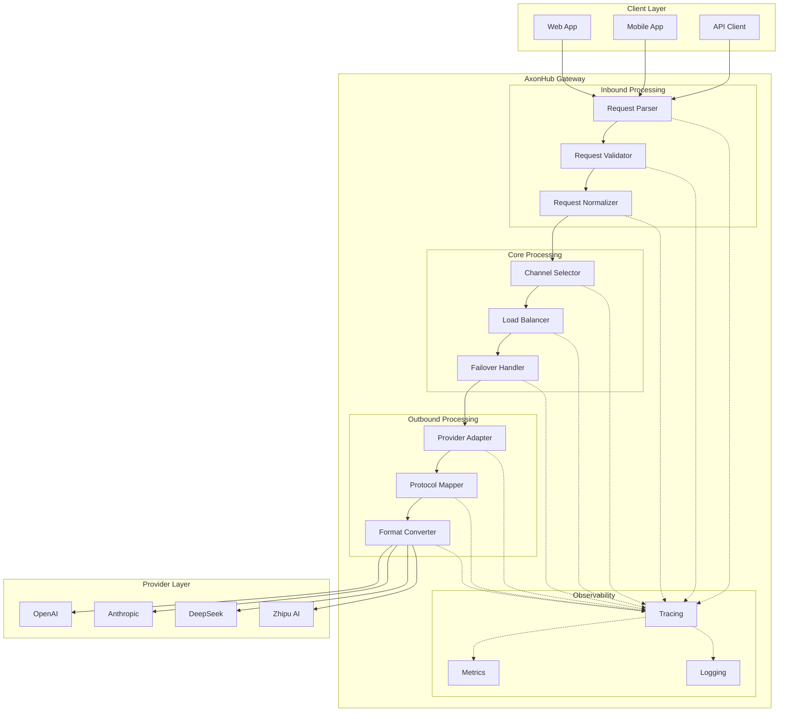

# Transformation Flow Architecture

## Overview

AxonHub implements a sophisticated bidirectional data transformation pipeline that ensures seamless communication between clients and AI providers. This document explains the architectural components and data flow within the system.

## Architecture Diagram



## Component Details

### Client Layer

**Components:**
- **Web Applications**: Browser-based applications using AxonHub API
- **Mobile Applications**: Native mobile apps consuming AxonHub services
- **API Clients**: Programmatic clients using SDKs or direct HTTP calls

**Responsibilities:**
- Send requests in OpenAI-compatible format
- Handle authentication via API keys
- Process streaming responses when applicable

### Inbound Processing

#### Request Parser
- **Purpose**: Parse incoming HTTP requests
- **Features**:
  - Extract request headers and body
  - Validate request structure
  - Parse JSON payloads
  - Handle multipart/form-data for file uploads

#### Request Validator
- **Purpose**: Validate request parameters and content
- **Features**:
  - Validate required fields
  - Check parameter ranges and constraints
  - Verify authentication and authorization
  - Validate message format and structure

#### Request Normalizer
- **Purpose**: Standardize request format
- **Features**:
  - Convert request to unified internal format
  - Apply default values
  - Handle provider-specific parameter mappings
  - Normalize message content structure

### Core Processing

#### Channel Selector
- **Purpose**: Choose the appropriate AI provider channel
- **Features**:
  - Model-based routing
  - Cost optimization
  - Performance-based selection
  - Custom routing rules

#### Load Balancer
- **Purpose**: Distribute requests across available channels
- **Features**:
  - Round-robin distribution
  - Weighted routing based on channel capacity
  - Health check integration
  - Dynamic load adjustment

#### Failover Handler
- **Purpose**: Handle provider failures gracefully
- **Features**:
  - Automatic retry with exponential backoff
  - Fallback to alternative providers
  - Circuit breaker pattern
  - Error classification and handling

### Outbound Processing

#### Provider Adapter
- **Purpose**: Adapt requests to provider-specific formats
- **Features**:
  - Transform unified request to provider format
  - Handle provider-specific authentication
  - Apply provider-specific parameters
  - Manage provider rate limits

#### Protocol Mapper
- **Purpose**: Handle different communication protocols
- **Features**:
  - HTTP/1.1 and HTTP/2 support
  - WebSocket handling for real-time communication
  - Server-Sent Events (SSE) for streaming
  - Protocol translation when necessary

#### Format Converter
- **Purpose**: Convert between different data formats
- **Features**:
  - JSON schema transformation
  - Message format conversion
  - Image and media format handling
  - Encoding and decoding

### Observability

#### Tracing
- **Purpose**: Track request flow through the system
- **Features**:
  - Distributed tracing with OpenTelemetry
  - Request correlation
  - Performance monitoring
  - Error tracking

#### Metrics
- **Purpose**: Collect system performance metrics
- **Features**:
  - Request latency monitoring
  - Error rate tracking
  - Resource utilization
  - Custom business metrics

#### Logging
- **Purpose**: Record system events and activities
- **Features**:
  - Structured logging
  - Log aggregation
  - Audit trail
  - Debug information

## Data Flow

### Request Flow

1. **Client Request**
   ```
   Client → HTTP Request → AxonHub Gateway
   ```

2. **Inbound Processing**
   ```
   Parse → Validate → Normalize → Unified Request
   ```

3. **Core Processing**
   ```
   Channel Selection → Load Balancing → Failover Handling
   ```

4. **Outbound Processing**
   ```
   Provider Adaptation → Protocol Mapping → Format Conversion
   ```

5. **Provider Call**
   ```
   AxonHub → Provider API → Provider Response
   ```

6. **Response Processing**
   ```
   Parse Provider Response → Normalize → Format for Client
   ```

7. **Client Response**
   ```
   AxonHub → HTTP Response → Client
   ```

### Streaming Flow

For streaming requests, the flow is similar but maintains persistent connections:

1. **Stream Setup**
   ```
   Client → Stream Request → AxonHub → Provider Stream
   ```

2. **Data Flow**
   ```
   Provider Chunks → AxonHub Processing → Client Chunks
   ```

3. **Stream Completion**
   ```
   Provider End → AxonHub Cleanup → Client Completion
   ```

## Key Architectural Patterns

### 1. Pipeline Pattern

Each request flows through a series of processing stages, with each stage responsible for a specific transformation or validation.

### 2. Adapter Pattern

Provider-specific adapters handle the translation between unified internal format and provider-specific APIs.

### 3. Strategy Pattern

Different strategies for channel selection, load balancing, and failover handling can be configured and swapped.

### 4. Observer Pattern

Observability components monitor the request flow without interfering with the core processing.

### 5. Circuit Breaker Pattern

Failover handling implements circuit breakers to prevent cascading failures when providers are unavailable.

## Performance Considerations

### Latency Optimization

1. **Connection Pooling**: Reuse HTTP connections to providers
2. **Caching**: Cache provider responses and model lists
3. **Parallel Processing**: Process multiple requests concurrently
4. **Stream Processing**: Handle streaming responses efficiently

### Scalability

1. **Stateless Design**: Most components are stateless for horizontal scaling
2. **Database Sharding**: Support for distributed databases
3. **Cache Distribution**: Distributed caching for high availability
4. **Load Distribution**: Multiple gateway instances behind load balancer

### Reliability

1. **Graceful Degradation**: Continue operation with reduced functionality
2. **Automatic Recovery**: Self-healing for transient failures
3. **Health Monitoring**: Continuous monitoring of all components
4. **Backup Strategies**: Multiple fallback options for critical paths

## Security Architecture

### Authentication & Authorization

1. **API Key Validation**: Validate API keys and associated permissions
2. **Role-Based Access Control**: Fine-grained permission system
3. **Request Scoping**: Limit requests to authorized resources
4. **Audit Logging**: Record all authentication events

### Data Protection

1. **Input Validation**: Sanitize all incoming data
2. **Output Encoding**: Prevent injection attacks
3. **Sensitive Data Handling**: Secure storage of credentials
4. **Transport Security**: TLS encryption for all communications

## Monitoring and Observability

### Metrics Collection

- **Request Rate**: Number of requests per second
- **Latency Distribution**: Response time percentiles
- **Error Rates**: Failure rates by provider and endpoint
- **Resource Usage**: CPU, memory, and network utilization

### Logging Strategy

- **Structured Logging**: JSON-formatted logs for easy parsing
- **Correlation IDs**: Track requests across service boundaries
- **Log Levels**: Configurable logging verbosity
- **Log Retention**: Configurable retention policies

### Alerting

- **Performance Alerts**: Latency and error rate thresholds
- **Availability Alerts**: Service downtime detection
- **Security Alerts**: Suspicious activity detection
- **Capacity Alerts**: Resource exhaustion warnings

## Related Documentation

- [Entity Relationship Diagram](erd.md)
- [OpenAI API](../api-reference/openai-api.md)
- [Anthropic API](../api-reference/anthropic-api.md)
- [Gemini API](../api-reference/gemini-api.md)
- [Deployment Guide](../deployment/configuration.md)
- [Tracing Guide](../guides/tracing.md)