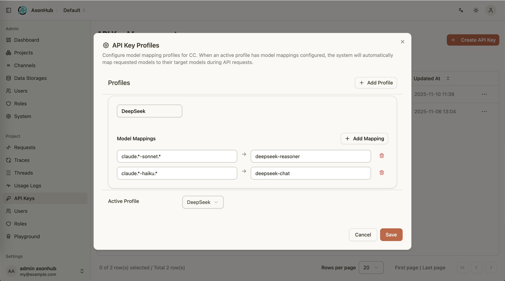

# Claude Code & Codex Integration Guide

---

## Overview
AxonHub can act as a drop-in replacement for Anthropic or OpenAI endpoints, letting Claude Code and Codex connect through your own infrastructure. This guide explains how to configure both tools and how to combine them with AxonHub model profiles for flexible routing.

### Key Points
- AxonHub performs AI protocol/format transformation. You can configure multiple upstream channels (providers) and expose a single Anthropic/OpenAI-compatible interface for tools like Claude Code and Codex.
- You can aggregate Claude Code requests from the same session into one trace (see "Configure Claude Code").
- You can aggregate Codex requests from the same conversation by configuring `server.trace.extra_trace_headers` (see "Configure Codex").

### Prerequisites
- AxonHub instance reachable from your development machine.
- Valid AxonHub API key with project access.
- Access to Claude Code (Anthropic) and/or Codex (OpenAI compatible) applications.
- Optional: one or more model profiles configured in the AxonHub console.

### Configure Claude Code
1. Open your shell environment and export the AxonHub credentials:
   ```bash
   export ANTHROPIC_AUTH_TOKEN="<your-axonhub-api-key>"
   export ANTHROPIC_BASE_URL="http://localhost:8090/anthropic"
   ```
2. Launch Claude Code. It will read the environment variables and route all Anthropic requests through AxonHub.
3. (Optional) Confirm the integration by triggering a chat completion and checking AxonHub traces.

#### Trace aggregation (optional)
To aggregate requests from the same Claude Code session into a single trace, enable the following in `config.yml`:

```yaml
server:
  trace:
    claude_code_trace_enabled: true
```

#### Tips
- Keep your API key secret; store it in a shell profile or secret manager.
- If your AxonHub endpoint uses HTTPS with a self-signed certificate, configure trust settings in your OS.

### Configure Codex
1. Edit `${HOME}/.codex/config.toml` and register AxonHub as a provider:
   ```toml
   model = "gpt-5"
   model_provider = "axonhub-responses"

   [model_providers.axonhub-responses]
   name = "AxonHub using Chat Completions"
   base_url = "http://127.0.0.1:8090/v1"
   env_key = "AXONHUB_API_KEY"
   wire_api = "responses"
   query_params = {}
   ```
2. Export the API key for Codex to read:
   ```bash
   export AXONHUB_API_KEY="<your-axonhub-api-key>"
   ```
3. Restart Codex to apply the configuration.

#### Trace aggregation by conversation (optional)
If Codex sends a stable conversation identifier header (for example `Conversation_id`), you can configure AxonHub to use it as a fallback trace header in `config.yml`:

```yaml
server:
  trace:
    extra_trace_headers:
      - Conversation_id
```

#### Testing
- Send a sample prompt; AxonHub's request logs should show a `/v1/chat/completions` call.
- Enable tracing in AxonHub to inspect prompts, responses, and latency.

### Working with Model Profiles
AxonHub model profiles remap incoming model names to provider-specific equivalents:
- Create a profile in the AxonHub console and add mapping rules (exact name or regex).
- Assign the profile to your API key.
- Switch active profiles to alter Claude Code/Codex behavior without changing tool settings.

<table>
  <tr align="center">
    <td align="center">
      <a href="../../screenshots/axonhub-profiles.png">
        
      </a>
      <br/>
      Model Profiles
    </td>
  </tr>
</table>

#### Example
- Request `claude-sonnet-4-5` → mapped to `deepseek-reasoner` for getting more accurate responses.
- Request `claude-haiku-4-5` → mapped to `deepseek-chat` for reducing costs.

### Troubleshooting
- **Claude Code cannot connect**: verify `ANTHROPIC_BASE_URL` points to the `/anthropic` path and that your firewall allows outbound calls.
- **Codex reports authentication errors**: ensure `AXONHUB_API_KEY` is exported in the same shell session that launches Codex.
- **Unexpected model responses**: review active profile mappings in the AxonHub console; disable or adjust rules if necessary.

### Related Documentation
- [Tracing Guide](tracing.md)
- [Chat Completions](../api-reference/unified-api.md#openai-chat-completions-api)
- README sections on [Usage Guide](../../../README.md#usage-guide)
