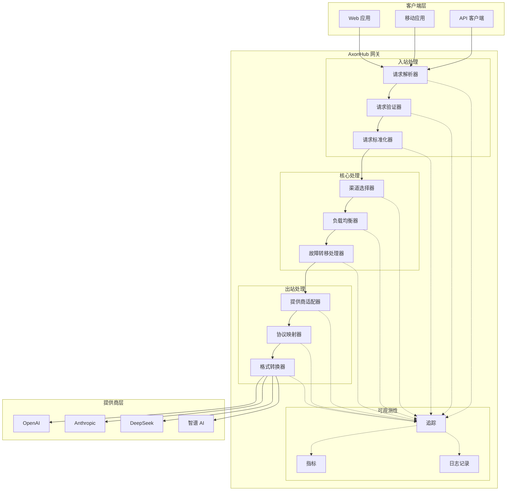

# 转换流程架构

## 概述

AxonHub 实现了一个复杂的双向数据转换管道，确保客户端和 AI 提供商之间的无缝通信。本文档解释了系统中的架构组件和数据流。

## 架构图



## 组件详情

### 客户端层

**组件：**
- **Web 应用程序**：使用 AxonHub API 的基于浏览器的应用程序
- **移动应用程序**：使用 AxonHub 服务的原生移动应用
- **API 客户端**：使用 SDK 或直接 HTTP 调用的程序化客户端

**职责：**
- 以 OpenAI 兼容格式发送请求
- 通过 API 密钥处理身份验证
- 在适用时处理流式响应

### 入站处理

#### 请求解析器
- **目的**：解析传入的 HTTP 请求
- **特性**：
  - 提取请求头和请求体
  - 验证请求结构
  - 解析 JSON 负载
  - 处理文件上传的 multipart/form-data

#### 请求验证器
- **目的**：验证请求参数和内容
- **特性**：
  - 验证必填字段
  - 检查参数范围和约束
  - 验证身份验证和授权
  - 验证消息格式和结构

#### 请求标准化器
- **目的**：标准化请求格式
- **特性**：
  - 将请求转换为统一的内部格式
  - 应用默认值
  - 处理提供商特定的参数映射
  - 标准化消息内容结构

### 核心处理

#### 渠道选择器
- **目的**：选择合适的 AI 提供商渠道
- **特性**：
  - 基于模型的路由
  - 成本优化
  - 基于性能的选择
  - 自定义路由规则

#### 负载均衡器
- **目的**：在可用渠道间分发请求
- **特性**：
  - 轮询分发
  - 基于渠道容量的加权路由
  - 健康检查集成
  - 动态负载调整

#### 故障转移处理器
- **目的**：优雅地处理提供商故障
- **特性**：
  - 带指数退避的自动重试
  - 回退到替代提供商
  - 断路器模式
  - 错误分类和处理

### 出站处理

#### 提供商适配器
- **目的**：将请求适配为提供商特定格式
- **特性**：
  - 将统一请求转换为提供商格式
  - 处理提供商特定的身份验证
  - 应用提供商特定参数
  - 管理提供商速率限制

#### 协议映射器
- **目的**：处理不同的通信协议
- **特性**：
  - 支持 HTTP/1.1 和 HTTP/2
  - 处理 WebSocket 以实现实时通信
  - 用于流式传输的服务器发送事件 (SSE)
  - 必要时进行协议转换

#### 格式转换器
- **目的**：在不同数据格式之间转换
- **特性**：
  - JSON 模式转换
  - 消息格式转换
  - 图像和媒体格式处理
  - 编码和解码

### 可观测性

#### 追踪
- **目的**：跟踪请求在系统中的流动
- **特性**：
  - 使用 OpenTelemetry 的分布式追踪
  - 请求关联
  - 性能监控
  - 错误跟踪

#### 指标
- **目的**：收集系统性能指标
- **特性**：
  - 请求延迟监控
  - 错误率跟踪
  - 资源利用率
  - 自定义业务指标

#### 日志记录
- **目的**：记录系统事件和活动
- **特性**：
  - 结构化日志记录
  - 日志聚合
  - 审计追踪
  - 调试信息

## 数据流

### 请求流

1. **客户端请求**
   ```
   客户端 → HTTP 请求 → AxonHub 网关
   ```

2. **入站处理**
   ```
   解析 → 验证 → 标准化 → 统一请求
   ```

3. **核心处理**
   ```
   渠道选择 → 负载均衡 → 故障转移处理
   ```

4. **出站处理**
   ```
   提供商适配 → 协议映射 → 格式转换
   ```

5. **提供商调用**
   ```
   AxonHub → 提供商 API → 提供商响应
   ```

6. **响应处理**
   ```
   解析提供商响应 → 标准化 → 格式化客户端响应
   ```

7. **客户端响应**
   ```
   AxonHub → HTTP 响应 → 客户端
   ```

### 流式流

对于流式请求，流程类似但保持持久连接：

1. **流式设置**
   ```
   客户端 → 流式请求 → AxonHub → 提供商流
   ```

2. **数据流**
   ```
   提供商分块 → AxonHub 处理 → 客户端分块
   ```

3. **流式完成**
   ```
   提供商结束 → AxonHub 清理 → 客户端完成
   ```

## 关键架构模式

### 1. 管道模式

每个请求流经一系列处理阶段，每个阶段负责特定的转换或验证。

### 2. 适配器模式

提供商特定的适配器处理统一内部格式和提供商特定 API 之间的转换。

### 3. 策略模式

可以配置和替换渠道选择、负载均衡和故障转移处理的不同策略。

### 4. 观察者模式

可观测性组件监控请求流而不干扰核心处理。

### 5. 断路器模式

故障转移处理实现断路器，以防止在提供商不可用时出现级联故障。

## 性能考量

### 延迟优化

1. **连接池**：重用与提供商的 HTTP 连接
2. **缓存**：缓存提供商响应和模型列表
3. **并行处理**：并发处理多个请求
4. **流式处理**：高效处理流式响应

### 可扩展性

1. **无状态设计**：大多数组件是无状态的，便于水平扩展
2. **数据库分片**：支持分布式数据库
3. **缓存分布**：分布式缓存以实现高可用性
4. **负载分布**：负载均衡器后的多个网关实例

### 可靠性

1. **优雅降级**：以降级功能继续运行
2. **自动恢复**：瞬态故障的自我修复
3. **健康监控**：对所有组件的持续监控
4. **备份策略**：关键路径的多个回退选项

## 安全架构

### 身份验证和授权

1. **API 密钥验证**：验证 API 密钥和相关权限
2. **基于角色的访问控制**：细粒度权限系统
3. **请求范围**：将请求限制在授权资源
4. **审计日志**：记录所有身份验证事件

### 数据保护

1. **输入验证**：清理所有传入数据
2. **输出编码**：防止注入攻击
3. **敏感数据处理**：安全存储凭据
4. **传输安全**：所有通信的 TLS 加密

## 监控和可观测性

### 指标收集

- **请求率**：每秒请求数
- **延迟分布**：响应时间百分位数
- **错误率**：按提供商和端点的失败率
- **资源使用**：CPU、内存和网络利用率

### 日志策略

- **结构化日志记录**：JSON 格式的日志便于解析
- **关联 ID**：跨服务边界跟踪请求
- **日志级别**：可配置的日志详细程度
- **日志保留**：可配置的保留策略

### 告警

- **性能告警**：延迟和错误率阈值
- **可用性告警**：服务停机检测
- **安全告警**：可疑活动检测
- **容量告警**：资源耗尽警告

## 相关文档

- [实体关系图](erd.md)
- [OpenAI API](../api-reference/openai-api.md)
- [Anthropic API](../api-reference/anthropic-api.md)
- [Gemini API](../api-reference/gemini-api.md)
- [部署指南](../deployment/configuration.md)
- [追踪指南](../guides/tracing.md)
