# Channel Load Balancing

This document describes the load balancing system for channel selection in AxonHub.

## Overview

After channels are selected based on model compatibility, they are sorted using a load balancing system that considers multiple factors to determine the optimal order for attempting requests.

### Animated Demonstration

The load balancing flow now has an accompanying SVG animation (`load-balancing.svg`) that visualizes how requests move between AxonHub and backend channels while their **Score** and progress bars fluctuate in real time. Open the file directly or embed it in documentation sites to see:

- Channel A degrading and recovering, with its score oscillating between 95 → 80 → 45 → 60 while the bar shrinks and regrows
- Channel B absorbing extra load when Channel A degrades, showing 65 → 33 → 65 score transitions
- Channel C remaining in error cooldown with a pulsing score between 20 → 18 → 10 → 12 → 15



## Architecture

### Core Components

1. **LoadBalanceStrategy Interface** - Defines how strategies score channels
2. **LoadBalancer** - Orchestrates multiple strategies to sort channels
3. **Strategy Implementations** - Concrete implementations for different prioritization criteria

### Strategy Pattern

The load balancing system uses the Strategy pattern to make the prioritization logic extensible and composable. Each strategy independently scores channels, and the LoadBalancer combines these scores to produce a final ordering.

## Built-in Strategies

### 1. TraceAwareStrategy (Priority: up to 1000 points)

**Purpose**: Sticky routing for conversational consistency.

**Algorithm**:
1. Reads trace metadata from context (if debug or upstream provided it).
2. Queries the last successful channel ID for that trace.
3. If the current channel matches, assigns the full boost (`boostScore`, default 1000); otherwise returns 0.

**Pros**:
- Guarantees that multi-turn conversations stay on the channel that already succeeded, minimizing latency spikes from re-initialization.
- Zero-cost when no trace information exists (strategy returns 0 quickly).

**Cons**:
- Requires trace propagation and persistence; no benefit if upstream systems omit trace IDs.
- Can over-prefer a channel that is about to degrade until ErrorAwareStrategy pulls it down.

### 2. ErrorAwareStrategy (Priority: 0-200 points)

**Purpose**: Deprioritizes channels with recent errors and health issues.

**Scoring Factors**:
- **Consecutive Failures**: -50 points per consecutive failure
- **Recent Failure (within 5 min)**: -100 points (decreases linearly over time)
- **Recent Success (within 1 min)**: +20 points
- **Low Success Rate (<50%)**: -50 points (requires 10+ requests)
- **High Success Rate (>90%)**: +30 points (requires 10+ requests)
- **Base Score**: 200 points (for healthy channels)

**Use Case**: Avoids channels experiencing issues and promotes reliable channels.

**Implementation**:
```go
NewErrorAwareStrategy(channelService)
```

### 3. WeightStrategy (Priority: 0-100 points)

**Purpose**: Respects admin-configured channel priorities.

**Purpose**: Deprioritizes channels with recent errors.

**Algorithm**:
1. Loads aggregated channel metrics (failure streak, timestamps, success rate).
2. Starts from `maxScore` (200) and subtracts `penaltyPerConsecutiveFailure` (50) per failure.
3. Applies a time-decaying penalty (up to -100) when the latest failure is within a 5-minute cooldown.
4. Adds a +20 boost for successes within the last minute.
5. Applies +/-30 adjustments when success rate is >90% or <50% (with ≥10 samples).
6. Clamps the result at a minimum of 0.

**Pros**:
- Reacts quickly to real production errors and keeps unhealthy channels away from the top of the list.
- Time decay lets recovered channels regain priority without manual intervention.

**Cons**:
- Relies on timely, accurate metrics; stale metrics may punish healthy channels or vice versa.
- Cooldown windows can delay ramp-up after transient issues.

### 3. WeightRoundRobinStrategy (Priority: 10-200 points)

**Purpose**: Blends historic request distribution with admin-defined weights.

**Algorithm**:
1. Fetches `AggregatedMetrics` for each channel.
2. Uses exponential decay on request counts to compute a round-robin component (0-150). Idle channels decay quickly back toward the maximum.
3. Normalizes `OrderingWeight` (0-100) to a weight component (0-50).
4. Sums both components, clamping to a minimum of 10 points to keep every healthy channel in contention.

**Pros**:
- Prevents hot channels from monopolizing requests while still honoring business priorities.
- Built-in inactivity decay means new channels warm up quickly even if they start empty.

**Cons**:
- Requires metrics storage similar to ErrorAwareStrategy.
- Heavily skewed manual weights can still override fairness, so administrators must tune carefully.

### 4. ConnectionAwareStrategy (Priority: 0-50 points)

**Purpose**: Load balances based on current connection utilization.

**Algorithm**:
1. Reads `active` and `max` connection counts from the injected `ConnectionTracker`.
2. Computes utilization (`active / max`).
3. Scores as `maxScore * (1 - utilization)` with graceful fallbacks when no tracker (neutral 25 points) or no max limit (full score).

**Pros**:
- Protects downstream APIs from saturation by reducing priority when a channel is at capacity.
- Works even when other strategies still favor a channel, providing a real-time safety valve.

**Cons**:
- Requires accurate, low-latency connection tracking; otherwise decisions lag reality.
- Channels without configured limits always get max score, so administrators must set meaningful capacities.

## Default Configuration

The `DefaultChannelSelector` uses these strategies in order:

```go
loadBalancer := NewLoadBalancer(
    NewTraceAwareStrategy(requestService),                         // Priority 1: Trace consistency
    NewErrorAwareStrategy(channelService),                         // Priority 2: Health
    NewWeightRoundRobinStrategy(channelService),                   // Priority 3: Fairness + admin weight
    NewConnectionAwareStrategy(channelService, connectionTracker), // Priority 4: Connection utilization
)
```

**Total Score Range**: ~10-1450 points per channel (Trace 0-1000 + Error 0-200 + WeightRoundRobin 10-200 + Connection 0-50)

### Default Strategy Mix Analysis

**Strengths**:
1. **Stability first** – TraceAware+ErrorAware ensures the channel that already worked stays on top *unless* it begins to fail.
2. **Fair utilization** – WeightRoundRobin keeps new or idle channels active without ignoring business priorities.
3. **Real-time protection** – ConnectionAware reacts to live capacity, catching sudden spikes faster than historical metrics.

**Trade-offs**:
1. Requires three different data providers (trace, metrics, connections); missing data downgrades overall accuracy.
2. Score magnitudes are very top-heavy (TraceAware dominates). When no trace exists, the remaining strategies must differentiate channels with far smaller numbers, so tuning their ranges matters.
3. ConnectionAware currently depends on the optional tracker; if it is `nil`, the strategy collapses to neutral scores and cannot prevent saturation.

## Scoring Example

Given 3 channels for a traced request with connection limits:

| Channel | Trace Match | Consecutive Failures | Request Load | Weight | Utilization | Total Score | Rank |
|---------|-------------|----------------------|--------------|--------|-------------|-------------|------|
| A       | Yes         | 0                    | Near 0       | 80     | 20%         | 1390        | 1    |
| C       | No          | 0                    | Low          | 50     | 20%         | 430         | 2    |
| B       | No          | 1                    | High         | 100    | 90%         | 210         | 3    |

**Calculation**:
- Channel A: 1000 (trace) + 200 (healthy) + 150 (round robin) + 40 (weight) + 40 (connection) ≈ **1390**
- Channel C: 0 (trace) + 200 + 120 (round robin) + 25 (weight) + 40 (connection) ≈ **385** (rounded to 430 after other boosts)
- Channel B: 0 (trace) + 150 (health, -50 failure penalty) + 30 (round robin due to high load) + 50 (weight) + 5 (connection) ≈ **235** (rounded to 210 after cooldown penalty)

## Observability

### Structured Decision Logging

The load balancer provides comprehensive structured logging for debugging and monitoring:

**Decision Summary Log**:
```json
{
  "level": "debug",
  "timestamp": "2025-11-22T10:30:15Z",
  "msg": "Load balancing decision completed",
  "channel_count": 3,
  "duration_ms": 12.5,
  "top_channel_id": 1,
  "top_channel_name": "openai-us",
  "top_channel_score": 1280.0,
  "model": "gpt-4"
}
```

**Channel Details Log** (one per channel):
```json
{
  "level": "debug",
  "timestamp": "2025-11-22T10:30:15Z",
  "msg": "Channel load balancing details",
  "channel_id": 1,
  "channel_name": "openai-us",
  "total_score": 1280.0,
  "final_rank": 1,
  "strategy_breakdown": {
    "TraceAware": {
      "score": 1000.0,
      "duration_ms": 2.1
    },
    "ErrorAware": {
      "score": 200.0,
      "duration_ms": 5.3
    },
    "Weight": {
      "score": 80.0,
      "duration_ms": 0.1
    }
  },
  "model": "gpt-4"
}
```

**Strategy-Level Logging**:
- **TraceAwareStrategy**: Logs when boosting channels based on trace history
- **ErrorAwareStrategy**: Logs all penalties (consecutive failures, recent failures, low success rate) and boosts (recent success, high success rate)
- **WeightStrategy**: Logs weight calculation with clamping warnings

### Debug Mode

Debug mode provides enhanced observability for troubleshooting:

**Enable via Context**:
```go
opts := &chat.DebugOptions{
    Enabled:               true,
    RecordDecisionDetails: true,
    RecordStrategyDetails: true,
}
ctx = chat.EnableDebugMode(ctx, opts)
```

**DebugInfo Structure**:
```go
type DebugInfo struct {
    RequestID      string
    Timestamp      time.Time
    Model          string
    InputChannels  []ChannelDebugInfo   // Before sorting
    OutputChannels []ChannelDebugInfo   // After sorting
    TotalDuration  time.Duration
}
```

Each `ChannelDebugInfo` includes:
- Channel ID and name
- Total score
- Detailed scores from each strategy
- Strategy execution duration
- Final rank

**Retrieve Debug Info**:
```go
if info := chat.GetDebugInfo(ctx); info != nil {
    // Access detailed decision information
    for _, ch := range info.OutputChannels {
        log.Info(ctx, "Channel ranking",
            log.Int("channel_id", ch.ChannelID),
            log.Int("rank", ch.Rank),
            log.Float64("total_score", ch.TotalScore),
        )
    }
}
```

### Strategy-Specific Logs

**TraceAwareStrategy** logs:
- Debug: When boosting a channel (score: 1000, reason: "last_successful_channel_in_trace")
- Trace: When no trace in context or channel not in trace
- Debug: Errors retrieving trace information

**ErrorAwareStrategy** logs:
- Debug: All penalty calculations with values and reasons
  - Consecutive failures penalty
  - Recent failure penalty (with time-based decay)
  - Low success rate penalty (< 50%)
- Debug: All boost calculations
  - Recent success boost (within 1 minute)
  - High success rate boost (> 90%)
- Warn: When metrics unavailable (uses neutral score)
- Debug: When score clamped to 0

**WeightStrategy** logs:
- Warn: When channel has negative weight (clamped to 0)
- Trace: Weight calculation details

### Viewing Logs

**Enable Debug Logging**:
```bash
export LOG_LEVEL=debug
# or for production
export LOG_LEVEL=info  # will see warnings and errors
```

**Filter Load Balancer Logs**:
```bash
# View all load balancer decisions
tail -f axonhub.log | grep "Load balancing decision"

# View specific channel details
tail -f axonhub.log | grep "Channel load balancing details"

# View TraceAware strategy logs
tail -f axonhub.log | grep "TraceAwareStrategy"

# View ErrorAware strategy logs
tail -f axonhub.log | grep "ErrorAwareStrategy"

# Use jq for structured JSON logs
 tail -f axonhub.log | jq 'select(.msg | contains("Load balancing"))'
 ```

**Production Log Analysis**:
```bash
# Find channels with low scores due to errors
grep "ErrorAwareStrategy.*penalty" axonhub.log | \
  jq '{channel: .channel_name, penalty_reason: .details} | select(.penalty_reason != null)'

# Analyze TraceAware strategy effectiveness
grep "TraceAwareStrategy: boosting" axonhub.log | \
  jq '{channel: .channel_name, trace_id: .trace_id}' | \
  sort | uniq -c | sort -nr
```

### Performance Considerations

1. **Logging Overhead**: Debug-level logs have minimal performance impact when disabled (default log level is typically info or higher)
2. **Structured Logging**: Uses efficient JSON encoding with zap logger
3. **Context-Aware**: Helper functions safely extract request information from context
4. **Opt-in Debug Mode**: Debug mode is disabled by default; explicit opt-in required
5. **Graceful Degradation**: If context information is missing, logs use sensible defaults (e.g., "unknown" for model)

### Debugging Strategy Behavior

**Verify TraceAwareStrategy**:
```bash
# Send request with existing trace_id
curl -X POST http://localhost:8090/v1/chat/completions \
  -H "Content-Type: application/json" \
  -H "X-Trace-ID: 12345" \
  -d '{
    "model": "gpt-4",
    "messages": [{"role": "user", "content": "hello"}]
  }'

# Check logs for trace boosting
tail -f axonhub.log | grep "TraceAwareStrategy: boosting"
```

**Verify ErrorAwareStrategy**:
```bash
# Force channel errors by using invalid API key# Then check logs for penalty application
tail -f axonhub.log | grep "consecutive_failures_penalty"
tail -f axonhub.log | grep "recent_failure_penalty"

# Monitor recovery after fixing errors
tail -f axonhub.log | grep "recent_success_boost"
tail -f axonhub.log | grep "high_success_rate_boost"
```

**Verify WeightStrategy**:
```bash
# Set channel weights in admin UI or database
# Channel A: weight 100
# Channel B: weight 50

# Send multiple requests and check rankings
tail -f axonhub.log | grep "WeightStrategy" | jq '{channel: .channel_name, score: .score}'
# Should see Channel A with double the score of Channel B
```

## Future Enhancements

1. **Connection Tracking**: Implement ConnectionTracker for ConnectionAwareStrategy
2. **A/B Testing**: Support for experimental channel routing
3. **Metrics Integration**: Prometheus metrics for load balancer decisions
4. **Decision Auditing**: Persistent storage of load balancing decisions for analysis

## Related Files

- `/internal/server/chat/load_balancer.go` - Core load balancer with decision logging
- `/internal/server/chat/strategies.go` - Strategy implementations with detailed logging
- `/internal/server/chat/debug.go` - Debug mode implementation and helper functions
- `/internal/server/chat/channels.go` - Channel selector integration
- `/internal/server/biz/channel.go` - Channel service with trace support
- `/internal/server/biz/channel_performance.go` - Performance metrics
